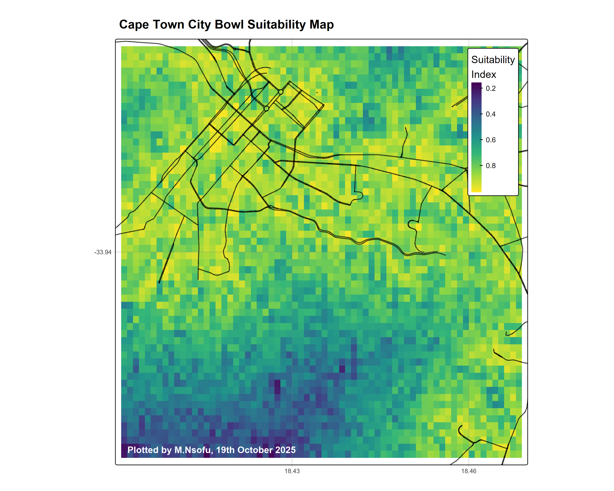

# 🌍 Modern R Suitability Analysis — Cape Town City Bowl

**Author:** M. Nsofu  
**Date:** 19th October 2025  
**Output File:** `cape_town_suitability_map.png`

---

## 🧭 Overview

This project demonstrates a **modern spatial decision support model** built entirely in **R** using open data from **OpenStreetMap (OSM)** and synthetic terrain simulation. The analysis identifies **spatial suitability** across Cape Town’s City Bowl based on two main criteria:

1. **Proximity to major roads** (accessibility)
2. **Terrain slope** (ease of development)

A composite **Suitability Index (0–1)** is generated, where yellow areas represent the **most suitable** regions and dark purple areas represent **least suitable** regions.  
Protected nature reserves are automatically excluded from consideration.

---

## 🧩 Key Features

- Automatic OSM data retrieval for roads and protected areas  
- Synthetic Digital Elevation Model (DEM) creation  
- Terrain slope calculation using the `terra` package  
- Raster-based distance computation to road networks  
- Weighted suitability model combining multiple factors  
- High-resolution visualization using `tmap`  
- Publication-ready PNG export (300 dpi)

---

## 🧮 Methodology

| Step | Description |
|------|--------------|
| 1️⃣ | Define the **Area of Interest (AOI)** for Cape Town City Bowl |
| 2️⃣ | Download and process **road** and **protected area** layers from OSM |
| 3️⃣ | Generate a **synthetic DEM** and compute **slope** |
| 4️⃣ | Calculate **Euclidean distance** from each cell to the nearest road |
| 5️⃣ | Normalize all layers to a 0–1 range for comparison |
| 6️⃣ | Combine layers into a weighted **Suitability Index** (`0.6*roads + 0.4*slope`) |
| 7️⃣ | Mask out **protected areas** (non-developable land) |
| 8️⃣ | Render the **Suitability Map** with legends, grid, and credits |

---

## 🧠 R Packages Used

| Package | Purpose |
|----------|----------|
| **osmdata** | Download and extract OpenStreetMap features |
| **terra** | Raster manipulation, terrain, and distance analysis |
| **sf** | Vector spatial data handling |
| **tidyverse** | Data wrangling and functional programming |
| **tmap** | Thematic cartography and high-quality visualization |

---

## 🧱 Code Structure

```r
# Modern R Suitability Analysis for Cape Town City Bowl
# By M.Nsofu, 19th October 2025

# Load libraries
library(osmdata)
library(terra)
library(sf)
library(tidyverse)
library(tmap)

# 1. Define AOI
# 2. Download OSM data
# 3. Create synthetic DEM and slope
# 4. Calculate distance to roads
# 5. Compute suitability score
# 6. Mask protected areas
# 7. Visualize and export
```

The script is fully reproducible and modular, allowing replacement of the synthetic DEM with real elevation data from sources like **SRTM**, **ASTER**, or **Copernicus DEM**.

---

## 🗺️ Output

**File:** `cape_town_suitability_map.png`  



**Interpretation:**
- **Yellow areas:** Highly suitable (flat terrain, close to roads)  
- **Green/blue areas:** Moderately suitable  
- **Purple areas:** Low suitability (steep slopes or remote from roads)  
- **Red outlines:** Protected areas excluded from analysis  

---

## ⚙️ Reproducibility Notes

- Ensure an active internet connection for OSM data retrieval.  
- Requires R ≥ 4.2 and the latest CRAN versions of dependencies.  
- Adjust the bounding box (`aoi_bbox`) for different regions or scales.  
- Replace the synthetic DEM with a real one for more accurate terrain modeling.

---

## 📘 Citation

If you use or modify this workflow, please cite as:

> Nsofu, M. (2025). *Modern R Suitability Analysis for Cape Town City Bowl*. GitHub Repository, 19 October 2025.
