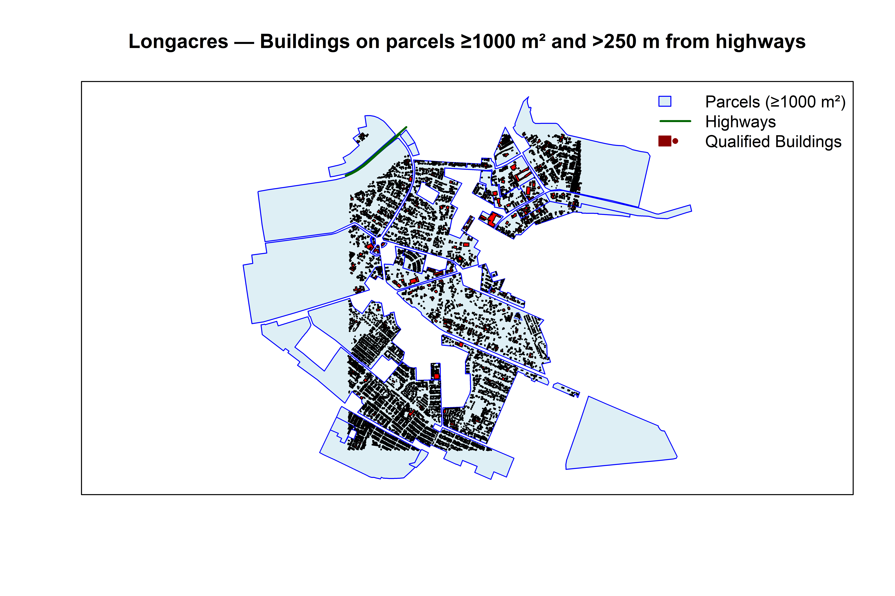

# 🗺️ Longacres Building Analysis (Lusaka, Zambia)



This project extracts and analyzes **OpenStreetMap (OSM)** data for the **Longacres area of Lusaka, Zambia**.  
It identifies buildings that meet three spatial criteria:

1. Located on land-use parcels (used as a proxy for cadastral parcels).  
2. On parcels with an area **≥ 1000 m²**.  
3. More than **250 m away from major highways**.  

The workflow uses **R** with the `osmdata` and `sf` ecosystems.

---

## 📦 Requirements

Make sure you have R (≥4.2) installed.  
The script installs missing packages automatically, but you can also install them manually:

```r
install.packages(c("osmdata", "sf", "dplyr", "purrr", "stringr", "glue", "units"))
```

---

## ⚙️ How It Works

1. **Bounding Box**  
   Defines a rectangle covering Longacres (`c(28.30, -15.44, 28.33, -15.40)`).

2. **Data Download**  
   Queries OSM for:
   - Building footprints  
   - Land use polygons (residential, commercial, institutional, etc.)  
   - Highways (`motorway`, `trunk`, `primary`)  

3. **Cleaning & Combining**  
   Handles polygons and multipolygons, makes geometries valid, and reprojects to UTM Zone 35S (EPSG:32735) for correct area/distance calculations.

4. **Filtering**  
   - Keeps parcels ≥ **1000 m²**.  
   - Selects buildings entirely within those parcels.  
   - Excludes buildings within **250 m** of highways.  

5. **Output**  
   - Prints the number of qualifying buildings.  
   - Returns an `sf` object `result_wgs84` with building attributes, parcel area, and distance to highways.  
   - Optionally saves results as:
     - **GeoPackage** (`.gpkg`) for GIS tools  
     - **High-resolution PNG (900 dpi)** map  

---

## 🖼️ Visualization

The base R plot shows:  

- Parcels (light blue, blue border)  
- Highways (green)  
- Qualified Buildings (red)  

To save as a **900 dpi PNG**:

```r
png("longacres_buildings_map.png", width=6, height=6, units="in", res=900)
# plotting code runs here...
dev.off()
```

---

## 🚀 Usage

Clone the repo and run in R/RStudio:

```bash
git clone https://github.com/yourusername/longacres-building-analysis.git
cd longacres-building-analysis
```

Then in R:

```r
source("longacres_building_analysis.R")
```

---

## 📂 Example Output

- **Console:**  
  ```
  Total qualifying buildings: 12
  ```
- **File:**  
  - `longacres_buildings_map.png` (map)  
  - `longacres_buildings.gpkg` (vector data, optional export)  

---

## 📌 Notes

- OSM **land use polygons** are used as a **proxy for parcels**. For cadastral-level accuracy, replace with official parcel data.  
- Adjust thresholds in the script:  
  - `MIN_PARCEL_AREA_M2` (default 1000 m²)  
  - `MIN_HWY_DIST_M` (default 250 m)  
- Expand bounding box if you want to analyze a larger area.  

---

## 📜 License

MIT License — feel free to use and adapt.  
